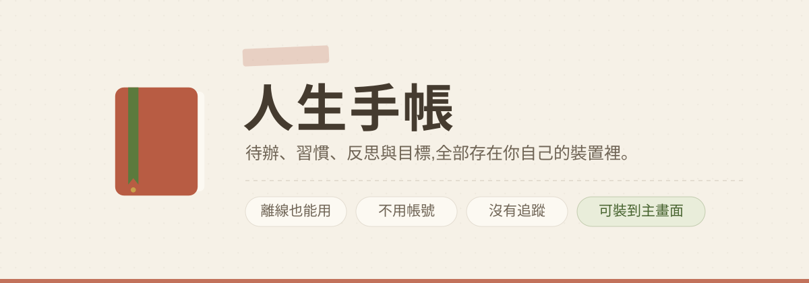

# 人生手帳

一本放在瀏覽器裡的中文手帳：待辦、習慣、反思、目標，全部存在你自己的裝置上。
沒有帳號、沒有伺服器、沒有追蹤，離線也能用。

**線上使用：** <https://ianyclin.github.io/life-journal/>
**製作：** [fb / 指數三寶飯](https://www.facebook.com/profile.php?id=100084000897269)

---

## 設計理念

這本手帳刻意不做「打卡焦慮」那一套：

- **休息不算失敗** — 習慣可以標記為休息日，連續天數會跳過而不中斷，也不列入熱度圖分母。
- **週目標取代日日全勤** — 設定「一週想做幾次」，比嚴格連續更走得遠。
- **習慣有最低版本** — 「太累時只讀一頁」，讓習慣容易接回來。
- **排幾件就慶祝幾件** — 今日重點排兩件、完成兩件，一樣值得慶祝。
- **隔夜未完成不是失敗** — 只是逐件重新安排，讓今天恢復清楚。
- **停滯的目標可以暫時放下** — 不催促，只邀請。
- **平衡不是平均** — 而是符合你此刻的選擇。

## 功能

| 分頁 | 內容 |
|---|---|
| 今日 | 箴言、今天最重要的三件事（上限 3）、我的目標（可釘選）、習慣打卡、接下來排定的日子、今晚的反思、本週領域平衡、人生回顧。版面可以自己拖曳排序與隱藏 |
| 待辦 | 今天/本週/之後三桶、預約日期（到期自動走進今天）、生活領域篩選、搜尋（關鍵字高亮）、批次整理、週期待辦、備註 |
| 習慣 | 月曆熱度圖（可補打卡、可標休息、可只看單一習慣）、近 7 天、週進度、連續天數、12 週趨勢 |
| 反思 | 心情 1–5、書寫提示、寫完按「封存」就收起來、近 30 天心情、過去的紀錄（含今天）、依心情搜尋 |
| 目標 | 目標與「為什麼重要」、小步驟、領域標籤、釘選兩個到今日頁、暫停、完成後寫入不可回退的人生紀錄 |

**回顧**:每週回顧（過去寫過的都收在「📖 過去的回顧」，可以隨時翻看與修改）、人生時光軸（可依年份篩選）、年度回顧（每月完成長條、心情的一年、陪你最久的習慣、時間放在哪裡）。

**箴言**:五個句庫可以複選 —— 手帳原生、佛教底色、親子教養、伴侶相處，以及你自己寫的句子。
入夜 18 點後每一包都會換成適合收尾的話。點首頁那句話可以換一句、把它收起來，或加一句自己的。
親子與伴侶包的稱謂是設定值（孩子叫你爸爸/媽媽、另一半是老婆/老公/伴侶），句子會跟著你家的說法變。

**其他**:自訂生活領域（改名/換色/增刪）、手帳鎖、每晚提醒、全域搜尋、
JSON 備份與 Markdown 匯出、桌面自動備份到檔案、鍵盤快捷鍵、深色模式、放大字級。

## 部署

只有幾個檔案，放到任何支援 HTTPS 的靜態空間即可（PWA 需要 HTTPS,`localhost` 除外）:

```
index.html    手帳本體
sw.js         離線與安裝能力
cover.svg     README 封面（網站本身用不到）
```

以 GitHub Pages 為例：推上 GitHub → Settings → Pages → Source 選 `main` 分支根目錄。
Cloudflare Pages、Netlify、Vercel 也都可以，不需要任何建置步驟。

**只放 `index.html` 也能運作**（它會先探測 `sw.js` 是否存在，不會在主控台留下 404）,
只是沒有離線能力，Chrome 也不會出現「安裝應用程式」提示。

### 裝到手機

- **iPhone**:用 Safari 開啟網址 → 分享 → 加入主畫面
- **Android**:用 Chrome 開啟 → 選單 → 安裝應用程式

裝好之後長按圖示，有「今日 / 待辦 / 反思」三個捷徑可以直接跳頁。

## 資料與隱私

- 所有紀錄存在瀏覽器的 localStorage，並在 IndexedDB 留最近 10 份救援快照。
- 資料**不會離開你的裝置**,程式也沒有任何對外連線。
- 設定頁可以開啟「長期保存」，降低瀏覽器在空間不足時清掉資料的機率。
- 用掉約 3.6 MB 時會提早提醒（瀏覽器對單一網站大約 5 MB）。
- 建議偶爾在設定頁下載備份檔。換手機時用「還原」匯入；兩台裝置都有寫的話用「合併」,
  以 id 為準比對，重複的不會變成兩筆，設定則維持本機。
- 桌面版 Chrome / Edge 可以授權一個檔案，之後自動寫回（放在 iCloud 或 Dropbox 資料夾就等於同步）。
- 另可匯出 Markdown 版本，在備忘錄、Notion、Word 裡打開，或直接印出來。

> **手帳鎖不是加密。** 它擋得住臨時拿走手機的人，擋不住懂技術的人。
> 之所以不加密，是因為忘記密碼就等於永久失去紀錄 —— 對一本要陪很久的手帳，這個代價太大。

## 本機預覽

Service Worker 不能在 `file://` 下運作，所以要用一個本機伺服器：

```bash
python3 -m http.server 8765
```

然後開 <http://localhost:8765>。

改完檔案後**要重新整理兩次**才會看到新版 —— Service Worker 是「先給快取、背景更新」,
第一次開啟拿到的是舊版，新版會在下一次生效。這是刻意的：開啟永遠是瞬間的。

## 瀏覽器需求

現代版 Safari / Chrome / Edge / Firefox。
每晚提醒在 iOS 需先加入主畫面，且系統不允許網頁在背景排程，手帳沒開著時可能不會準時響；
Android 與桌面 Chrome 則會透過背景定期同步補上。
桌面自動備份到檔案只有桌面版 Chrome / Edge 支援。
